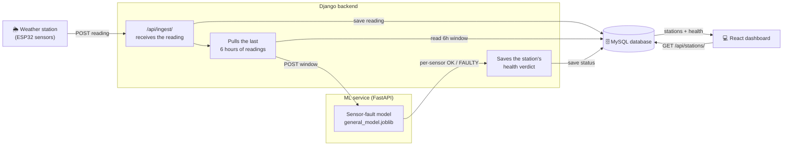
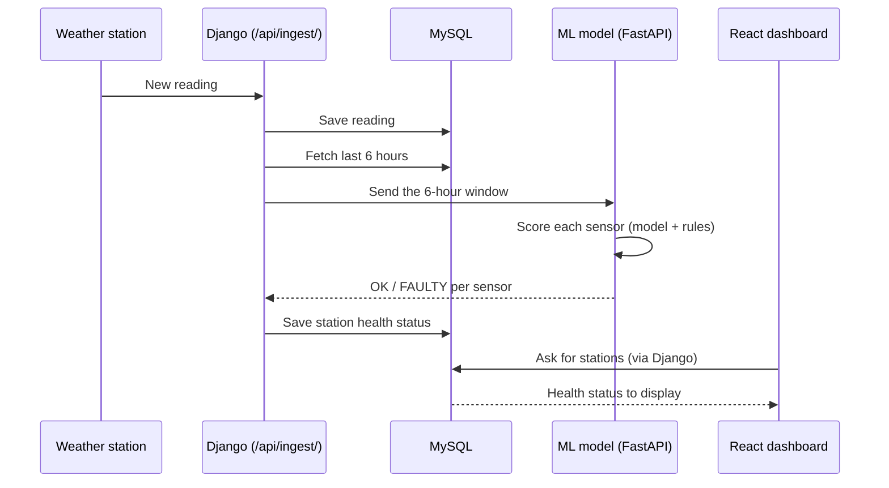

# The Sensor-Fault Detector — Explained

*A plain-language guide to the model, for anyone who needs to understand what it does
and how far to trust it.*

---

## 1. The one-sentence version

**It watches the weather stations and raises a hand when a sensor starts sending bad
data — before anyone downstream mistakes a broken sensor for real weather.**

It is like a **smoke detector**. A smoke detector does not predict fires and does not
tell you the temperature — it simply goes off when something is wrong. Our model does
the same for weather sensors: it does not forecast the weather; it flags a sensor that
has stopped behaving normally.

---

## 2. What problem it solves

A weather station has many sensors — temperature, humidity, pressure, wind, rainfall,
soil moisture. Sensors break in quiet ways: they freeze on one value, drift slowly out
of calibration, spike randomly, or get electrically noisy. When that happens, the
station keeps sending numbers that *look* like weather but are actually junk.

If nobody notices, that junk pollutes every report, chart, and decision built on the
data. Today, catching this means a person eyeballing graphs. **The model does that
watching automatically, sensor by sensor, around the clock.**

---

## 3. What it predicts (and what it does NOT)

| It DOES tell you | It does NOT tell you |
|---|---|
| "The soil-moisture sensor at this station looks faulty right now" | Tomorrow's weather |
| *Which* sensor is the problem | A repair instruction |
| *Why* it looks wrong (spike / drift / noise / frozen) | Anything about sensors it has no data for |

The output for each reading is simple: for every sensor, a verdict of **OK** or
**FAULTY**, plus a short reason.

---

## 4. The kinds of faults it catches

| Fault | What it looks like | How we catch it |
|---|---|---|
| **Spike** | A sudden impossible jump (e.g. temperature leaps 30° in 5 minutes) | Model |
| **Jitter** | The sensor gets electrically noisy — wild, rapid wobble | Model |
| **Drift** | A slow slide out of calibration over days | Model (this is the hard one — see §7) |
| **Stuck** | The sensor freezes on one value and never moves | Rule |
| **Impossible rain** | More rain reported than is physically possible | Rule |

The first three are caught by the **learned model**; the last two by simple **fixed
rules**, because some faults are better handled by a hard rule than by learning. A
frozen sensor, for example, reports a perfectly *normal-looking* value — the model
can't see anything wrong with the number itself, so a rule checks "has this value
changed at all in the last 6 hours?" instead.

---

## 5. How it works — in everyday terms

We do **not** give the model examples of broken sensors and say "learn to copy this."
We can't — nobody ever recorded which sensor was broken and when.

Instead we show it **months of normal, healthy sensor behaviour** and let it learn what
"normal" looks like from every angle. Once it knows normal deeply, anything that
doesn't fit stands out — the same way you'd instantly notice one out-of-tune
instrument in an orchestra you know well, without being taught what "out of tune"
sounds like. This is called an **Isolation Forest**, and the approach is called
*anomaly detection*.

Crucially, the model does not just look at the raw number. It looks at four **behaviour
signals** for each sensor:

| Signal | Plain meaning | Catches |
|---|---|---|
| **Value** | the reading itself | impossible values |
| **Step** | how much it jumped since last time | spikes |
| **Variability (6-hour)** | how much it's been moving lately | frozen or noisy sensors |
| **Spread** | how noisy it is within a single reading | jitter |

Looking at *behaviour* rather than the raw number is what lets one model work across
many different stations — a spike is a spike whether the station is hot or cold, high
or low.

---

## 6. How accurate is it?

**First, an honest note on what "accuracy" means here.** The network has never recorded
a real, confirmed sensor fault. So to test the model, we **simulated** faults —
injecting known spikes, drifts, freezes and noise into clean data — and measured
whether it caught them. Think of it as a fire drill rather than a real fire: strong
evidence, but a controlled test.

With that framing, here is how it did:

| Question | Answer | What it means |
|---|---|---|
| **When the data is fine, how often does it false-alarm?** | **~1 in 100** | This is measured on *real* data, so it's the most trustworthy number. Low false alarms. |
| **Does it catch obvious faults (spikes, noise)?** | **~100%** | It almost never misses a clear fault. |
| **Overall discrimination score (ROC-AUC)** | **0.87 / 1.00** | 0.5 is a coin-flip, 1.0 is perfect. 0.87 is strong. |
| **When it flags a fault, is it usually right?** | **~82%** | Most alarms are genuine, not noise. |
| **Does it catch slow drift?** | **Weaker** | The one area needing improvement (see §7). |

**Bottom line for a decision-maker:** it reliably catches the loud, obvious faults with
very few false alarms. It is weaker on slow, subtle drift. It is a strong first line of
defence, not a perfect one.

---

## 7. Honest limitations

A model is only trustworthy if you know where it's weak. Ours:

1. **Slow drift is hard.** Sudden faults are easy; a sensor sliding 0.1° per day is
   subtle. Catching that well would need a more advanced "memory" model — a clear next
   step, not a quick tweak.
2. **The test was simulated, not real.** Our numbers come from a fire drill. They will
   need confirming against real faults once the live system has been running a while.
3. **Calibration check is pending.** The model learned on data from our research
   stations. The live stations' sensors must be confirmed to speak the "same units"
   before the numbers are fully trusted — this depends on the hardware team telling us
   which stations will feed the system.

None of these are hidden — they're written into the code and documentation so the next
person sees them.

---

## 8. Practical facts

| | |
|---|---|
| **Coverage** | One general model works for every station, including new ones |
| **Speed** | Scores a reading in a fraction of a second |
| **Size** | ~26 MB — small enough to ship with the app (an earlier design was 2.2 GB) |
| **Sensors watched** | Temperature, humidity, pressure, wind speed & direction, soil moisture, rainfall |
| **What it needs** | About 6 hours of recent readings to judge each new one |
| **Trained on** | 13 stations, several years of data, ~11 million readings |

---

## 9. Why this design (in case you're asked)

- **One general model, not one per station** — because we don't yet know which stations
  will go live. A general model works everywhere from day one; station-specific models
  can be added later as an upgrade for stations with enough history.
- **Learning + rules together** — the model handles the subtle faults, fixed rules
  handle the ones better caught by common sense (a frozen or physically-impossible
  reading). Using both is more reliable than either alone.
- **Detection, not prediction** — the goal is data *trust*: making sure the numbers the
  network reports are real. That is the foundation everything else is built on.

---

## 10. How it plugs into the app (React + Django + MySQL)

The model is not a separate product — it sits inside the system we already have. Here
is the whole journey of one reading, from the weather station to the dashboard.

**In words:** the station posts a reading → Django saves it to MySQL → Django grabs the
last 6 hours and sends them to the model → the model replies with an OK/FAULTY verdict
for each sensor → Django saves that verdict → the React dashboard reads it and shows the
station as healthy or needing attention.

The model service is a **separate, self-contained piece**. It knows nothing about the
website, the database, or logins — it only receives a window of numbers and returns
verdicts. That keeps it simple to run, test, and replace.

### The same journey as a step-by-step timeline

### What changed vs. the old setup

The plumbing is the **same** — the model still lives behind the Django ingest endpoint,
exactly where the previous one did. Two things changed inside that step:

| | Old model | New model |
|---|---|---|
| **Question it answers** | "Is the whole station healthy?" | "Which *sensor* is sending bad data?" |
| **What the dashboard can show** | One overall status | The specific faulty sensor and why |

So no new moving parts were added to the architecture — the same reading still flows
station → Django → MySQL, with the model consulted along the way. The dashboard simply
gains the ability to point at the exact sensor at fault.
